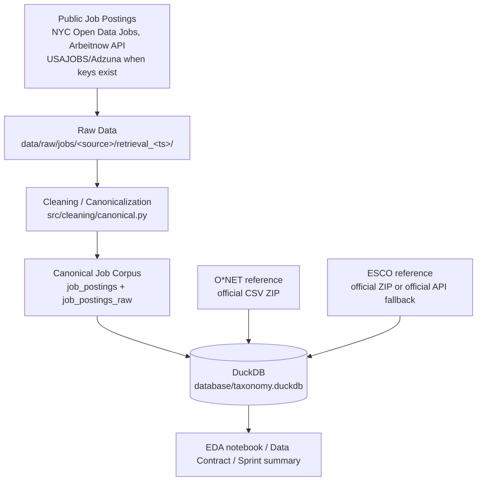

# IE7945 Workforce Analytics Capstone - Task/Skill Taxonomy Project

## Objective
Build a shared, reproducible job-posting corpus that two teams will later map to reference taxonomies:

* **Task team:** job posting -> tasks -> O\*NET mapping
* **Skill team:** job posting -> skills -> ESCO / Lightcast mapping

## Sprint 1 scope
Assemble the corpus and agree on a data contract: collect public postings, load them into a shared DuckDB
database together with the O\*NET and ESCO reference tables, profile the corpus (industry, seniority, length,
duplicates, language), and publish the data contract. **Not** in scope: taxonomy construction, embeddings,
LLM extraction, clustering or task/skill mapping.

## Architecture



## Actual data sources (see `docs/data_sources.md` for checksums, versions, terms)

| Source | Role | Access | Status |
|---|---|---|---|
| NYC Open Data - *Jobs NYC Postings* (City of New York, DCAS) | job postings | public CSV export, no key | Temporary bootstrap - instructor/team approval required before final corpus selection |
| Arbeitnow free public Job Board API | job postings (DE/EN) | public JSON API, no key | Temporary bootstrap - instructor/team approval required before final corpus selection |
| USAJOBS Search API | job postings | needs API key | not collected yet - `docs/USAJOBS_API_SETUP.md` |
| Adzuna API | job postings | needs app id/key | not collected yet |
| O\*NET 31.0 Database (CSV ZIP), O\*NET Resource Center | reference taxonomy | official download | final |
| ESCO v1.2.1 via official ESCO Web Services API | reference taxonomy | official API | temporary until the official CSV package is downloaded manually (`docs/ESCO_MANUAL_DOWNLOAD_REQUIRED.md`) |

## Directory structure
```
data/raw/jobs/<source>/retrieval_<UTC>/   raw job files/API pages (never modified)
data/reference/onet/raw/                  onet_database_<ver>_csv.zip (never modified)
data/reference/onet/extracted/<ver>/      extracted O*NET CSVs
data/reference/esco/raw/                  official ESCO ZIP (manual) and/or api_<ver>/retrieval_<UTC>/ (gzip API pages)
data/reference/esco/extracted/<ver>/      extracted ESCO CSVs (api_<ver>/ for the API fallback)
data/processed/                           job_postings_canonical.parquet
data/data_manifest.csv                    provenance: URLs, versions, timestamps, sizes, SHA-256, terms
database/taxonomy.duckdb                  shared database
notebooks/01_data_exploration.ipynb       executed EDA notebook
src/acquisition|ingestion|cleaning|analysis|utils
outputs/figures|tables|logs, outputs/sprint1_summary.md, outputs/meeting_brief.md
docs/                                     data_contract.md, data_sources.md, setup / manual-step docs
tests/                                    unit tests
```

## Installation (Windows PowerShell)
```powershell
python -m venv .venv
.\.venv\Scripts\python.exe -m pip install -r requirements.txt
```

## Credentials
Copy `.env.example` to `.env` (git-ignored) and optionally fill `USAJOBS_EMAIL`, `USAJOBS_API_KEY`,
`ADZUNA_APP_ID`, `ADZUNA_APP_KEY`. Without them the pipeline still runs on the public no-auth sources.
Credentials are only sent as request headers/params and are never written to files, logs or notebooks.

## Acquisition process
`python download_data.py` is idempotent: it discovers the current O\*NET version on
https://www.onetcenter.org/database.html, downloads the complete CSV ZIP, verifies it (non-empty, not an HTML page,
ZIP CRC test), extracts it, and records it in the manifest. ESCO: if an official ZIP is in `data/reference/esco/raw/`
it is used; otherwise the manual-download note is written and the official ESCO API is queried with an explicit
`selectedVersion` (validated by the API) and checked for completeness. Job sources follow the priority
local files -> USAJOBS -> Adzuna -> public bootstrap sources. Existing complete snapshots are reused;
`--refresh` takes a new one.

## Database
`database/taxonomy.duckdb` - rebuilt atomically on every run (no duplicated rows on re-run):
`job_postings`, `job_postings_raw`, view `job_postings_unique`, `source_metadata`, `data_manifest`,
`reference_load_report`, `pipeline_runs`, `onet_occupations`, `onet_tasks`, `onet_skills`, `onet_knowledge`,
`onet_abilities`, `onet_work_activities`, `onet_technology_skills` (+ content model, scales, job zones, alternate titles),
`esco_occupations`, `esco_skills`, `esco_occupation_skill_relations`, `esco_occupation_hierarchy`, `esco_skill_hierarchy`.

## EDA
`notebooks/01_data_exploration.ipynb` (executed by the pipeline) + `outputs/tables/*.csv`,
`outputs/figures/*.png`, `outputs/tables/sprint1_metrics.json`, `outputs/sprint1_summary.md`.

## Commands
```powershell
.\.venv\Scripts\python.exe download_data.py          # acquisition + validation only
.\.venv\Scripts\python.exe run_pipeline.py           # full reproducible pipeline + acceptance test
.\.venv\Scripts\python.exe run_pipeline.py --offline # no network, use preserved raw data
.\.venv\Scripts\python.exe run_pipeline.py --refresh # new job-source snapshot
.\.venv\Scripts\python.exe -m pytest tests -q        # unit tests
```

## Limitations
* Both job sources are temporary bootstrap sources (public sector NYC; Germany-centric aggregator) - not representative.
* Point-in-time snapshots; no source provides employer industry; seniority partly rule-derived; city not parsed.
* ESCO currently from the official API (v1.2.1), not the official CSV package.
* Job-source licence/terms marked "requires verification" in the manifest.

## Next steps (Sprint 2)
Get corpus approval, add USAJOBS credentials, place the official ESCO CSV ZIP, then start task and skill
extraction keyed on `posting_id` over `job_postings_unique`.
